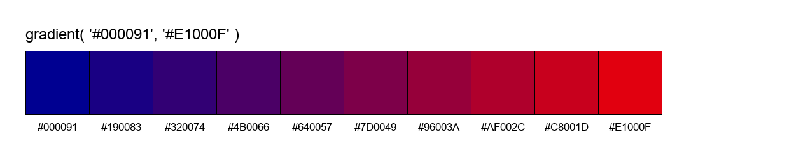

# Colorisator

Colorisator is a Python library for managing, manipulating, and generating colors.

It supports multiple formats (HEX, RGB, HSL, etc.), color operations, palettes, and gradients. Use this documentation to explore all features.

-   [Installation](docs/source/tutorials/installation.md)
-   [Basic Usage](docs/source/tutorials/basics.md)
-   [Choose your flavor (instance or static)](docs/source/tutorials/flavor.md)
-   [Operations (darken, lighten...)](docs/source/tutorials/operations.md)
-   [Gradient](docs/source/tutorials/gradient.md)
-   [Palettes](docs/source/tutorials/palettes.md)
